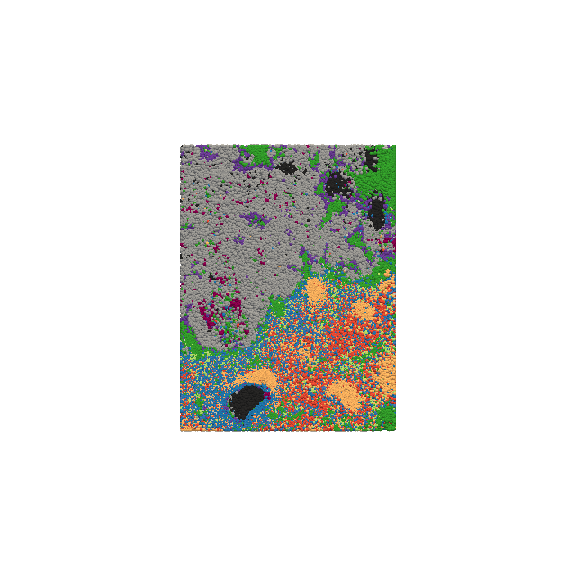
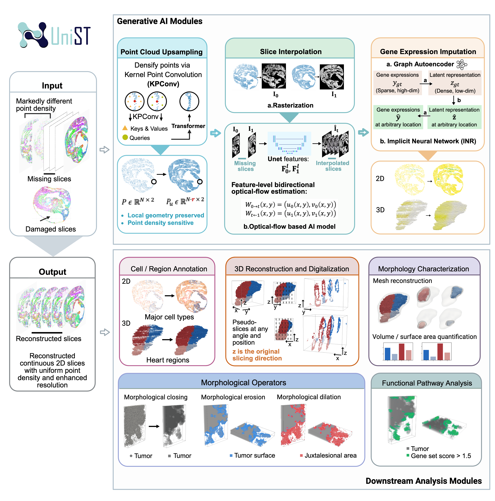

<div style="display:flex; align-items:center; gap:15px;">

<h1 style="margin:0;">UniST</h1>

[Tutorials](https://unist-tutorial.readthedocs.io/en/latest/) - [Overview](https://unist-tutorial.readthedocs.io/en/latest/overview.html)



</div>

A Unified Computational Framework for 3D Spatial Transcriptomics Reconstruction.

<p align="center">
  
</p>

## Installation

**From GitHub:**

```
pip install git+https://github.com/lanshui98/UniST.git
```

**Using requirements.txt:**

```
pip install -r requirements.txt
```

#### Build CUDA extensions (only for upsampling)

```
python setup_cuda_extensions.py
```

## Quick Start

### Upsampling
[Tutorial Page](https://unist-tutorial.readthedocs.io/en/latest/upsampling.html)

```
python -m upsampling.test_upsampling \
    --dataset pugan \
    --input_dir /path/to/input/pointclouds \
    --ckpt /path/to/pretrain/ckpt-best.pth \
    --r 2 \
    --save_dir /path/to/output \
    --flexible \
    --no_gt
```

**Arguments:**
- `--dataset`: Dataset type
- `--input_dir`: Directory containing input `.xyz` point cloud files
- `--ckpt`: Path to model checkpoint file (e.g., `pretrain/ckpt-best.pth`)
- `--r`: Upsampling rate
- `--save_dir`: Directory to save upsampled point clouds
- `--flexible`: Enable flexible upsampling rate (recommended)
- `--no_gt`: Skip evaluation (use when you don't have ground truth)

**Pre-trained weights**

Download the weights from google drive [link](https://drive.google.com/file/d/1af_de8YnG5eOAJaSDy1C5CmZRqaCCYb-/view?usp=sharing) and put under ./external/RepKPU_ops/pretrain/

### Interpolation

[Tutorial Page](https://unist-tutorial.readthedocs.io/en/latest/interpolation.html)

```
python -m interpolation.main \
    --mode auto \
    --tile_size 1024 1024 \
    --pth /path/to/image/folder
```

**Modes:**
- `auto`: Automatically detect and interpolate missing slices
- `no_skip`: Interpolate without skipping slices (requires `--skip` argument)
- `skip`: Interpolate with specified skip values (requires `--skip` argument)

**Pre-trained weights**

Download the weights from google drive [link](https://drive.google.com/drive/folders/1zw6kgpnxat_CEFoDWaVIHndxuKqk5vmD?usp=sharing) and put under ./external/InterpolAI/interpolation/

### Gene imputation

[Tutorial Page](https://unist-tutorial.readthedocs.io/en/latest/gene_imputation.html) - [Model Details](https://github.com/lanshui98/SUICA_pro)
