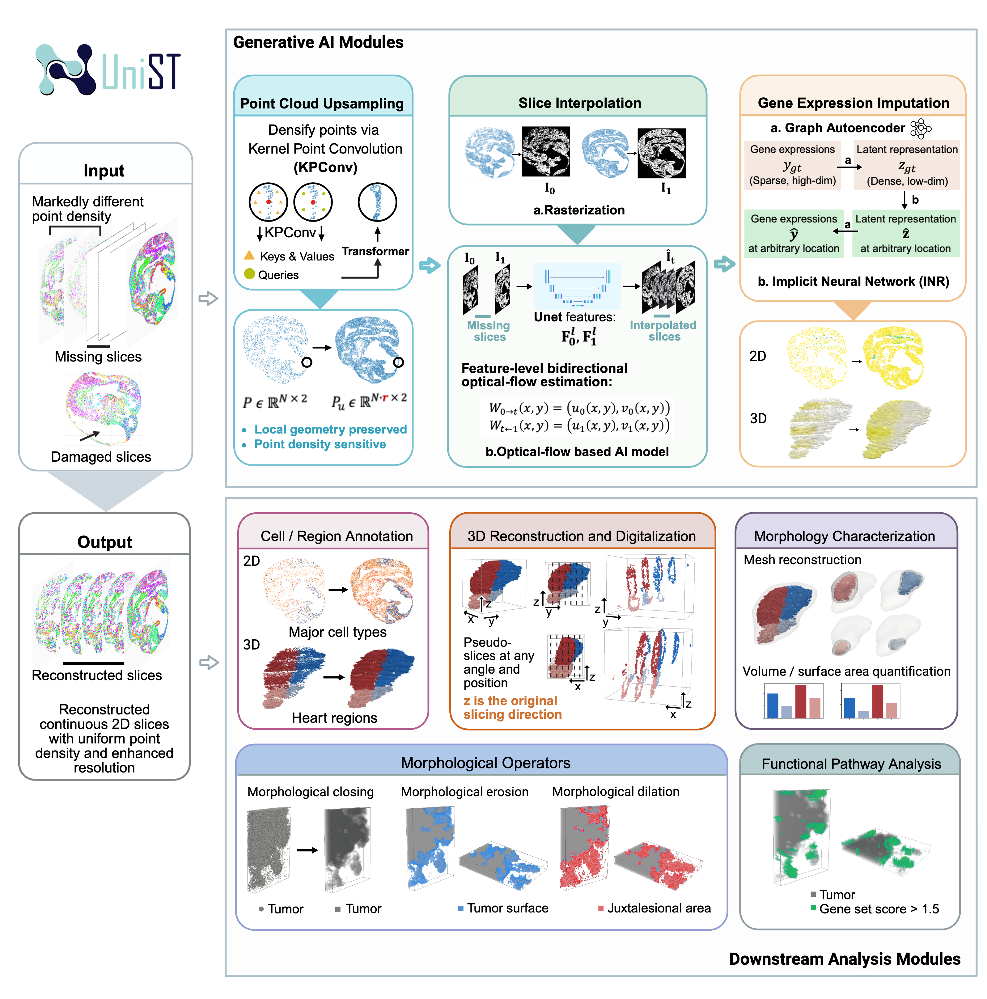

<h1>
  UniST
  
</h1>

[](https://pypi.org/project/unist/)
[](https://pypistats.org/packages/unist)
[](https://pepy.tech/project/unist)
[](https://pepy.tech/project/unist)
[](https://pypi.org/project/unist/)

### [🌐 Tutorial Website](https://unist-tutorial.readthedocs.io/en/latest/) · [📦 PyPI](https://pypi.org/project/unist/) · [📊 Download stats](https://pypistats.org/packages/unist)

A Unified Computational Framework for 3D Spatial Transcriptomics Reconstruction.

<p align="center">
  
</p>

## Installation

**From PyPI (recommended):**

```bash
pip install unist
```

**Full extras** (InterpolAI / PyVista / Lightning / SUICA INR):

```bash
pip install "unist[full]"
```

Download InterpolAI weights into `external/InterpolAI/interpolation/model/`
([Google Drive](https://drive.google.com/drive/folders/1zw6kgpnxat_CEFoDWaVIHndxuKqk5vmD?usp=sharing)).

**From GitHub:**

```bash
pip install git+https://github.com/lanshui98/UniST.git
```

**Using requirements.txt:**

```bash
pip install -r requirements.txt
```

#### Build CUDA extensions (only for upsampling)

```bash
python setup_cuda_extensions.py
```

## Quick Start — middle slice (one line)

Pipeline: **ST spots → occupancy image → InterpolAI → back to original xy** (`z_mid`), then annotate / impute.

```python
from unist import predict_middle_slice

# Fast: InterpolAI structure + spatial 1-NN cell type
middle = predict_middle_slice(slice_a, slice_b, mode="fast", label_key="cell_type")

# INR: InterpolAI structure + SUICA gene expression
#       + hybrid cell type (alpha * d_emb + (1-alpha) * d_spatial)
middle = predict_middle_slice(
    slice_a, slice_b,
    mode="inr",
    label_key="cell_type",
    work_dir="./unist_run",
    annotation_alpha=0.05,  # or "auto"
)
```

- **Geometry**: shared bbox occupancy grid → InterpolAI (`t=0.5`) → pixels mapped back to original coordinates.
- **fast**: spatial 1-NN labels.
- **inr**: SUICA_pro GAE+INR expression; cell type uses INR `fitted_embd` vs GAE embeddings with weight `annotation_alpha`.

## Upsampling
[Tutorial Page](https://unist-tutorial.readthedocs.io/en/latest/upsampling.html)

```
python -m upsampling.test_upsampling \
    --dataset pugan \
    --input_dir /path/to/input/pointclouds \
    --ckpt /path/to/pretrain/ckpt-best.pth \
    --r 2 \
    --save_dir /path/to/output \
    --flexible \
    --no_gt
```

**Arguments:**
- `--dataset`: Dataset type
- `--input_dir`: Directory containing input `.xyz` point cloud files
- `--ckpt`: Path to model checkpoint file (e.g., `pretrain/ckpt-best.pth`)
- `--r`: Upsampling rate
- `--save_dir`: Directory to save upsampled point clouds
- `--flexible`: Enable flexible upsampling rate (recommended)
- `--no_gt`: Skip evaluation (use when you don't have ground truth)

**Pre-trained weights**

Download the weights from google drive [link](https://drive.google.com/file/d/1af_de8YnG5eOAJaSDy1C5CmZRqaCCYb-/view?usp=sharing) and put under ./external/RepKPU_ops/pretrain/

### Interpolation

[Tutorial Page](https://unist-tutorial.readthedocs.io/en/latest/interpolation.html)

```
python -m interpolation.main \
    --mode auto \
    --tile_size 1024 1024 \
    --pth /path/to/image/folder
```

**Modes:**
- `auto`: Automatically detect and interpolate missing slices
- `no_skip`: Interpolate without skipping slices (requires `--skip` argument)
- `skip`: Interpolate with specified skip values (requires `--skip` argument)

**Pre-trained weights**

Download the weights from google drive [link](https://drive.google.com/drive/folders/1zw6kgpnxat_CEFoDWaVIHndxuKqk5vmD?usp=sharing) and put under ./external/InterpolAI/interpolation/

### Gene imputation

[Tutorial Page](https://unist-tutorial.readthedocs.io/en/latest/gene_imputation.html) - [Model Details](https://github.com/lanshui98/SUICA_pro)

## Citation
If you find our work is useful, please cite:

Shui, L., Liu, Y., Julio, I.C., Clemenceau, J.R., Hoi, X.P., Dai, Y., Lu, W., Min, J., Khan, K., Roemer, B. and Jiang, M., 2026. UniST: A Unified Computational Framework for 3D Spatial Transcriptomics Reconstruction. bioRxiv, pp.2026-03.
